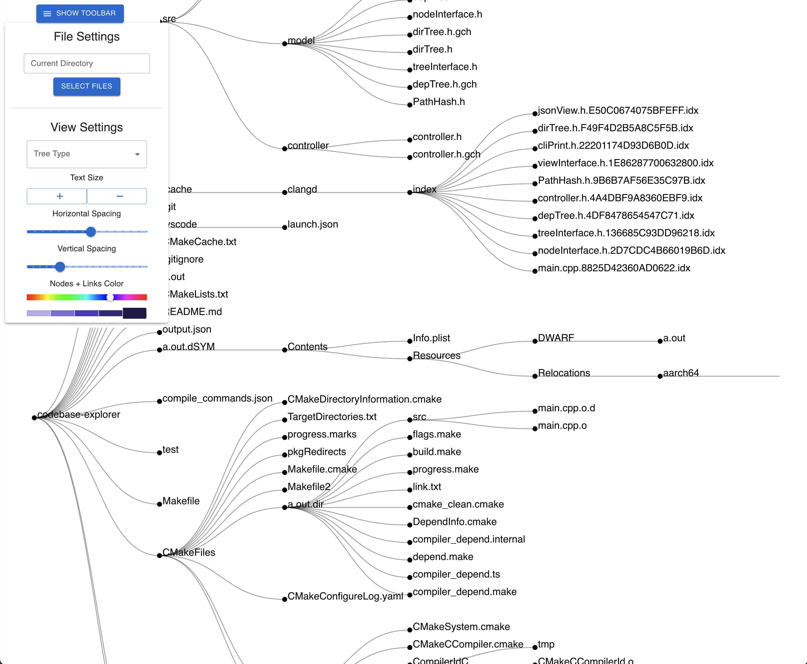

# Codebase Explorer
Codebase Explorer is an open-source project designed to facilitate a deeper understanding and effective management of a project's codebase. Whether you're a developer new to a project or a seasoned contributor, Codebase Explorer offers valuable insights into the structure, dependencies, and performance metrics of your code.

## Features

### 1. Explore Directory Structure
Gain a clear understanding of the organization of your codebase. Navigate through directories effortlessly to comprehend the layout and hierarchy of your project.

### 2. Dependency Analysis
Uncover relationships and dependencies between files within your codebase. Codebase Explorer assists in visualizing the intricate connections that form the backbone of your project.

### 3. Performance Metrics
Efficiently monitor memory and CPU usage associated with your codebase. Identify potential bottlenecks or resource-intensive components to optimize your project's performance.

## Language Support

Codebase Explorer currently provides support for C/C++ codebases. However, its modular architecture allows for seamless extension to support additional programming languages.

## Getting Started

### Prerequisites
Ensure you have the following prerequisites installed:

- [List of prerequisites and versions]

### Installation
1. Clone the repository: `git clone https://github.com/yourusername/codebase-explorer.git`
2. Navigate to the project directory: `cd codebase-explorer`
3. [Additional installation steps, if any]

### Usage
[Instructions on how to use Codebase Explorer, command-line options, etc.]

## Screenshots

*Caption for Screenshot 1*

*Caption for Screenshot 2*

## Contributing
We welcome contributions from the community. If you'd like to contribute to Codebase Explorer, please follow our [contribution guidelines].

## License
This project is licensed under the [License Name] - see the [LICENSE.md](LICENSE.md) file for details.

## Acknowledgments
[Optional: Acknowledge any libraries, tools, or individuals who have contributed to the project.]

